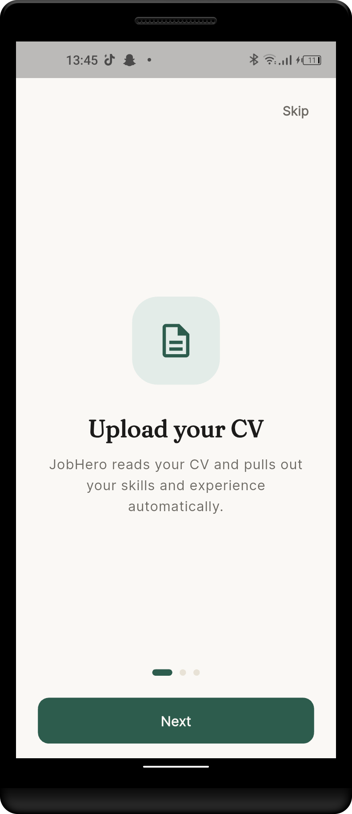
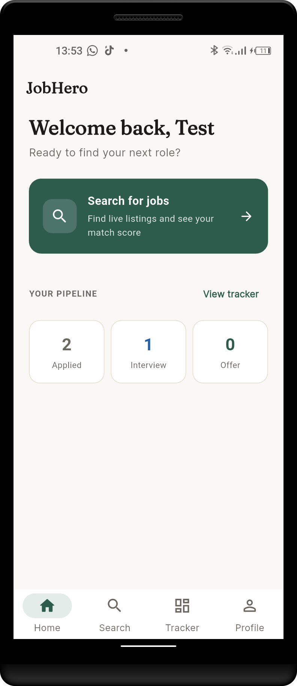
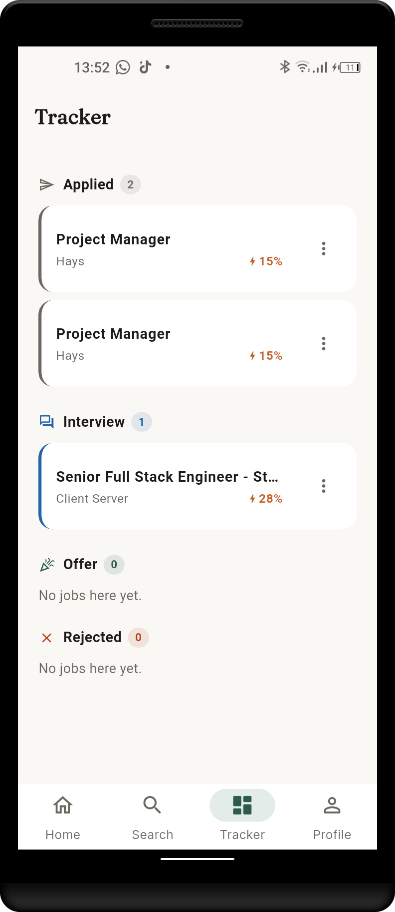
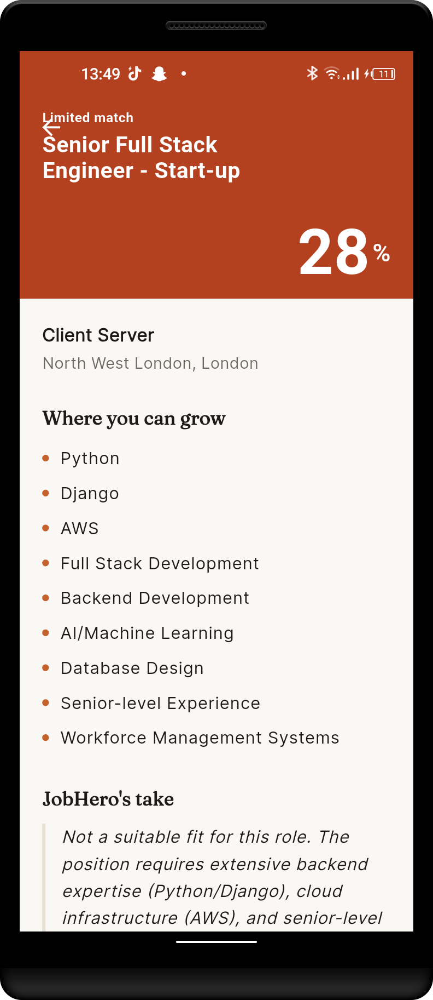
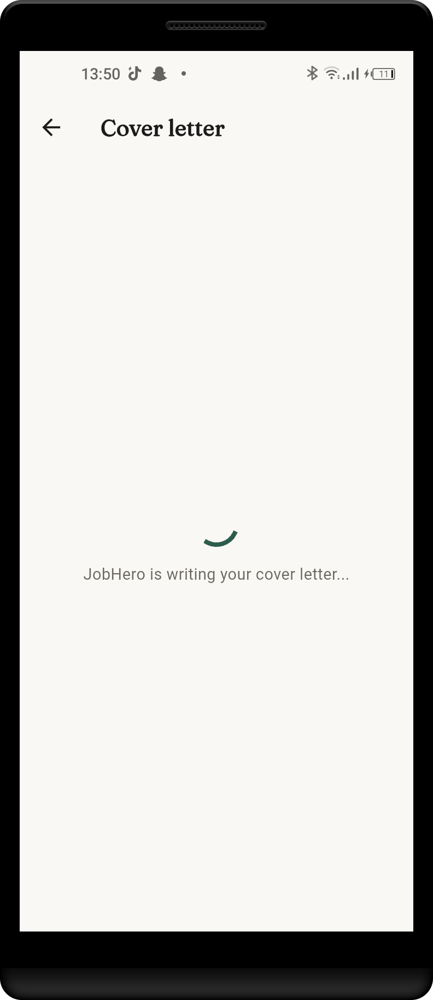

# JobHero

An AI-powered job search assistant built with Flutter and the Claude API. JobHero reads your CV, finds live job listings, scores how well you match each role, and generates tailored cover letters and interview prep — all from your phone.

**[Watch the demo](https://youtube.com/shorts/yh8DhrW2YAY?feature=share)**

## Overview

Most job search apps stop at listing jobs. JobHero goes further: it acts as an AI career agent that understands your actual skills and experience, then uses that understanding to score opportunities, write application materials, and help you prepare — turning a tedious search-and-apply loop into something closer to having a career coach in your pocket.

## Features

- **CV parsing** — upload a PDF and Claude extracts your skills, work experience, and keywords into a structured profile
- **Live job search** — Claude uses MCP tool-use to query the Adzuna API for real job listings based on title and location
- **AI match scoring** — compare your profile against any job description and get a 0–100% match score, a list of skills to build, and a written recommendation
- **Opt-in match scoring on search results** — score and sort an entire results list by best or lowest match before opening anything
- **Cover letter generation** — a tailored, ready-to-send cover letter for any job, generated in seconds
- **Interview prep** — role-specific interview questions with model answers based on your real experience
- **Application tracker** — a kanban-style board (Applied → Interview → Offer → Rejected) synced to Supabase
- **Home dashboard** — a quick-search shortcut and an at-a-glance view of your application pipeline
- **Profile** — review your parsed CV data at any time

## Screenshots

| Onboarding | Home | Tracker |
|---|---|---|
|  |  |  |  |  |


## Architecture

```
Flutter App (iOS / Android)
        │  HTTPS
        ▼
TanStack Start backend (Cloudflare Workers, via Lovable)
        │
        ├──► Claude API (claude-haiku-4-5-20251001) — CV parsing, match scoring,
        │     cover letters, interview prep
        │
        ├──► MCP tool-use ──► Adzuna API — live job listings
        │
        └──► Supabase (Postgres + Auth) — user profiles, saved jobs, application tracker
```

The mobile app never talks to Claude or Adzuna directly — all AI and third-party API calls are proxied through the backend, which holds the API keys and applies per-user authorization via Supabase Row Level Security.

## Tech stack

| Layer | Technology |
|---|---|
| Mobile | Flutter (Dart), Riverpod, supabase_flutter, file_picker |
| Backend | TanStack Start on Cloudflare Workers, deployed via Lovable |
| AI | Anthropic Claude API (claude-haiku-4-5-20251001) |
| Job data | Adzuna API, accessed via Claude MCP tool-use |
| Database & Auth | Supabase (Postgres, Row Level Security, email/password auth) |

## Screens

1. **Onboarding** — a three-slide introduction shown once on first install
2. **Auth** — email/password sign-up and login via Supabase
3. **CV Upload** — PDF upload and review of Claude's extracted skills and experience
4. **Home** — greeting, quick search shortcut, and pipeline stats
5. **Job Search** — search by title and location, with opt-in match scoring and sorting
6. **Job Detail** — match score, skills to build, and JobHero's recommendation
7. **Cover Letter** — AI-generated, tailored cover letter with copy-to-clipboard
8. **Interview Prep** — role-specific interview questions and model answers
9. **Tracker** — kanban board for tracking application stages
10. **Profile** — read-only view of parsed CV data, plus logout

## Setup

### Prerequisites

- Flutter SDK (3.8+)
- A Supabase project
- An Anthropic API key with available credit
- An Adzuna API account (app ID + key)
- A Lovable account, for backend hosting

### Backend

The backend is a separate Lovable project (TanStack Start on Cloudflare Workers). It is not included in this repository — see [backend repo link] for setup.

Required environment variables (set as Cloudflare Workers secrets in Lovable):

```
ANTHROPIC_API_KEY=
SUPABASE_URL=
SUPABASE_SERVICE_ROLE_KEY=
ADZUNA_APP_ID=
ADZUNA_API_KEY=
```

### Database

Run the SQL in `supabase/schema.sql` (or see below) against your Supabase project's SQL editor. This creates `profiles` and `saved_jobs` tables with Row Level Security enabled, scoped so each user can only read/write their own rows.

### Mobile app

```bash
git clone <this-repo-url>
cd job_search_assistant
flutter pub get
```

Update the Supabase URL and publishable key in `lib/main.dart`:

```dart
await Supabase.initialize(
  url: 'YOUR_SUPABASE_PROJECT_URL',
  publishableKey: 'YOUR_SUPABASE_ANON_KEY',
);
```

Update the backend base URL in `lib/services/api_service.dart`:

```dart
static const String baseUrl = 'YOUR_PUBLISHED_BACKEND_URL';
```

Generate the native splash screen (already configured in `pubspec.yaml`):

```bash
dart run flutter_native_splash:create
```

Run the app:

```bash
flutter run
```

## Known limitations

- CV parsing occasionally omits the `raw_text` field due to Haiku's variability on long, multi-field JSON responses; the rest of the extraction (skills, experience) is unaffected
- Job search is currently scoped to the UK (`gb` country code) on the Adzuna API
- Match scoring on a full search results list makes one Claude API call per job, so larger result sets take longer and cost more per search than scoring a single job

## Why this project

Flutter mobile development and AI-backend integration via MCP tool-use are not commonly combined in portfolio projects. JobHero demonstrates building a complete user-facing mobile app on top of a Claude-powered backend that makes its own tool-use decisions — not just calling an LLM API, but giving it real tools and letting it reason about when to use them.